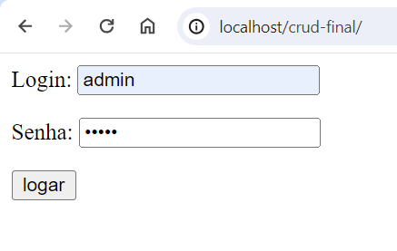
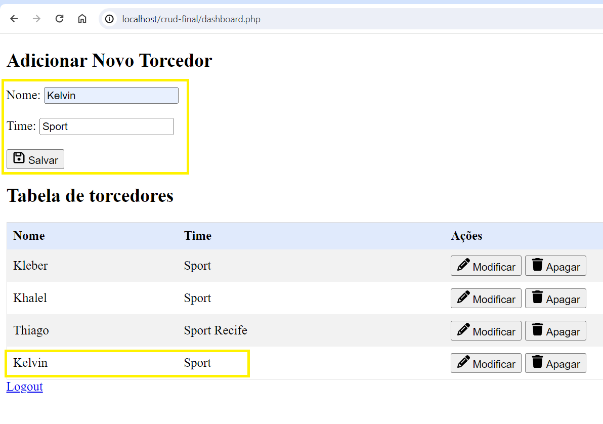
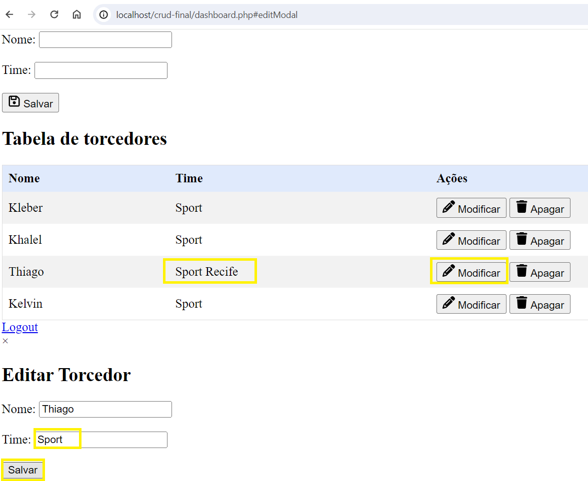
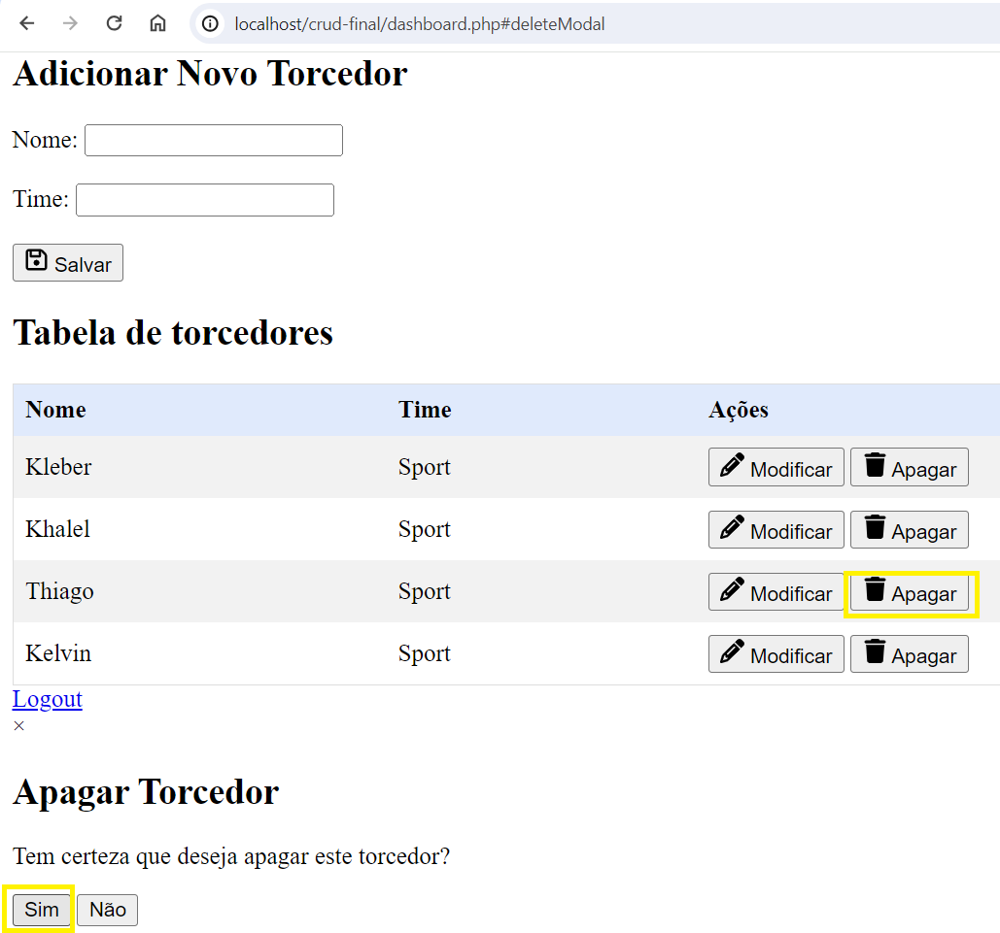
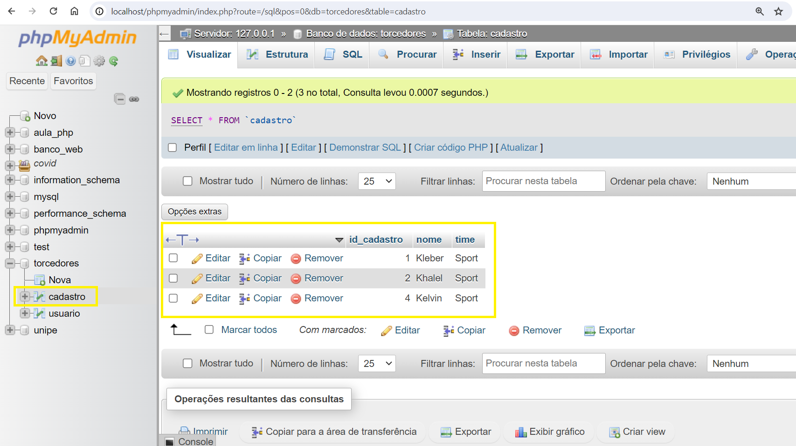

# PHP CRUD Project

## Descrição
Este projeto PHP é um sistema CRUD simples para gerenciar torcedores. Para que o projeto funcione corretamente, é necessário configurar um esquema MySQL conforme descrito abaixo.

## Configuração do Banco de Dados

1. Conecte-se ao MySQL usando seu cliente preferido (por exemplo, phpMyAdmin, MySQL Workbench ou terminal).
2. Execute as seguintes consultas SQL para configurar o banco de dados e as tabelas necessárias:

```sql
-- Cria o banco de dados se ele não existir
CREATE DATABASE IF NOT EXISTS torcedores;

-- Usa o banco de dados criado
USE torcedores;

-- Cria a tabela usuário
CREATE TABLE IF NOT EXISTS usuario (
    id_usuario INT AUTO_INCREMENT PRIMARY KEY,
    login VARCHAR(50) NOT NULL,
    senha VARCHAR(50) NOT NULL
);

-- Insere o usuário admin
INSERT INTO usuario (login, senha) VALUES
('admin', 'admin');

-- Cria a tabela cadastro
CREATE TABLE IF NOT EXISTS cadastro (
    id_cadastro INT AUTO_INCREMENT PRIMARY KEY,
    nome VARCHAR(50) NOT NULL,
    time VARCHAR(50) NOT NULL
);

-- Insere os dados na tabela cadastro
INSERT INTO cadastro (nome, time) VALUES
('Kleber', 'Sport'),
('Khalel', 'Sport'),
('Thiago', 'Sport Recife');
```

## Configuração do Projeto

Baixe ou clone este projeto para a pasta htdocs do XAMPP. O caminho completo deve ser C:\xampp\htdocs\crud-final.
Inicie o servidor Apache e MySQL através do painel de controle do XAMPP.

## Acesso ao Sistema

Abra o navegador e acesse o URL: http://localhost/crud-final
Use as credenciais padrão para login:

- Login: admin
- Senha: admin




## Funcionalidades

Após o login, você será redirecionado para a rota http://localhost/crud-final/dashboard.php, onde você pode gerenciar os dados da tabela cadastro. As funcionalidades incluem:

- Inserir novos torcedores


- Modificar torcedores existentes


- Excluir torcedores existentes


Todas as alterações são persistidas no banco de dados e podem ser acessadas via http://localhost/phpmyadmin.



## Observações
Certifique-se de que o servidor Apache e o MySQL estejam em execução antes de acessar o sistema.